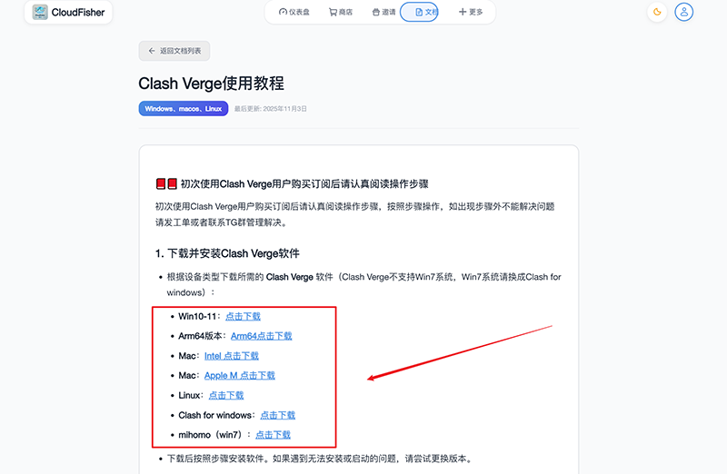
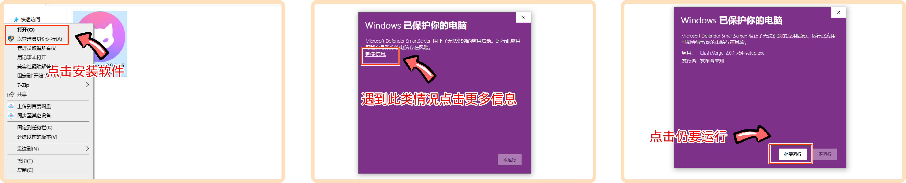
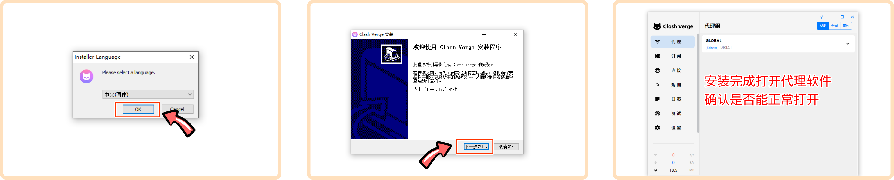
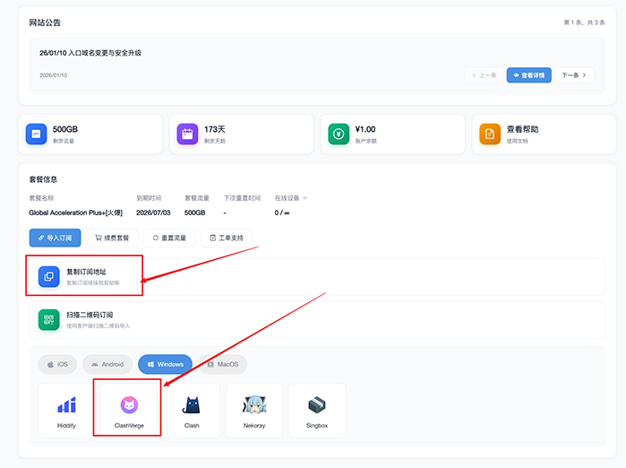
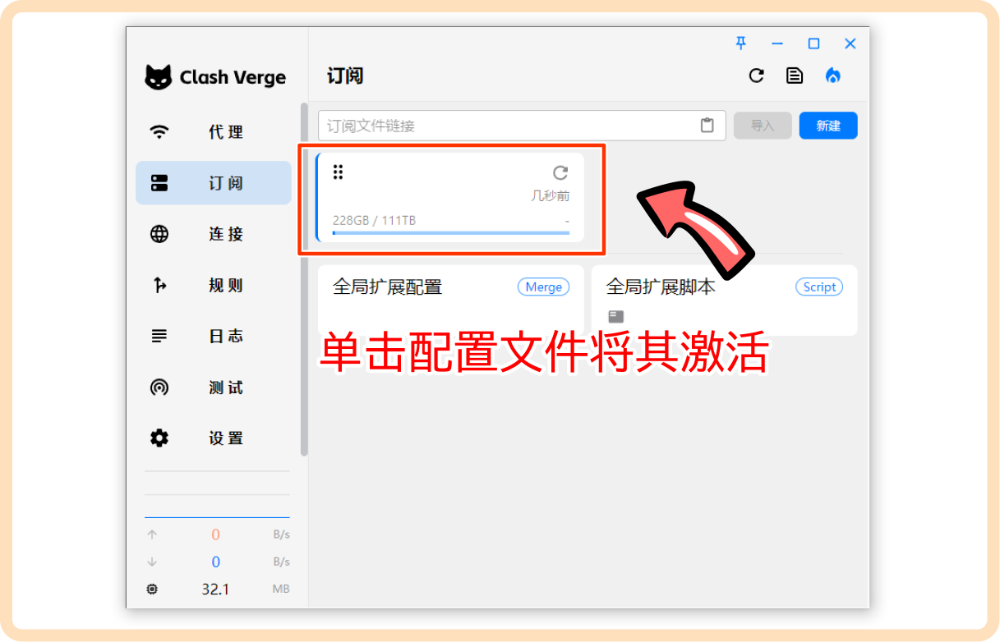
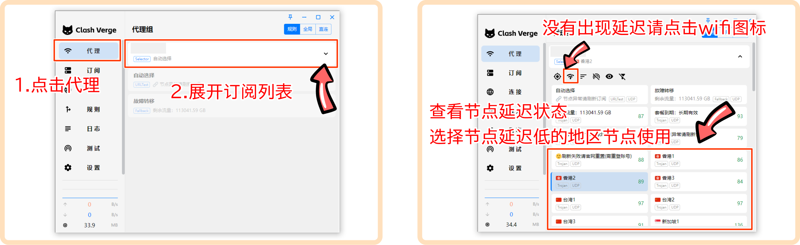
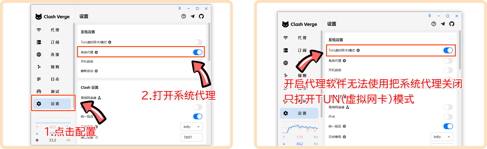
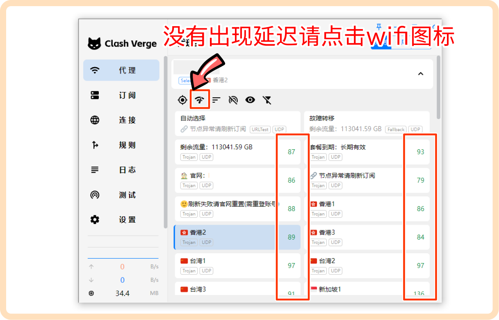
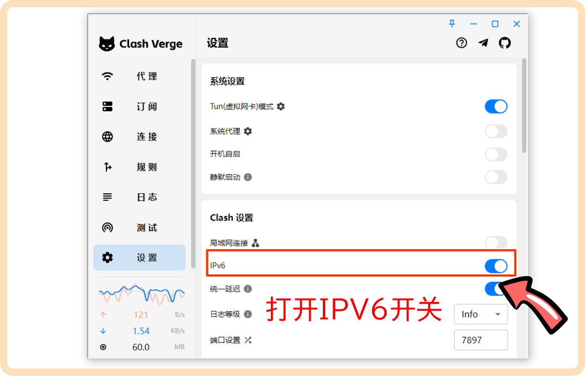
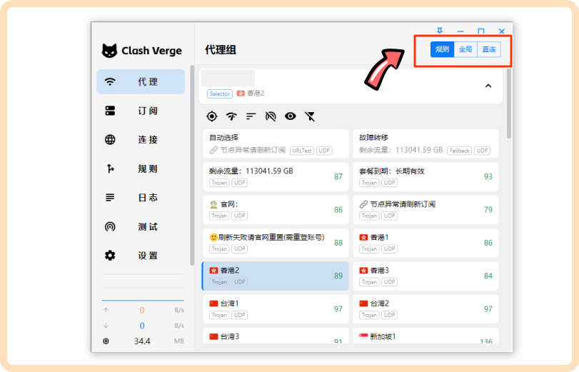

# Clash Verge 使用教程

**平台：** Windows、macOS、Linux  
**最后更新：** 2026年1月11日

---

## 📕📕 初次使用 Clash Verge 用户购买订阅后请认真阅读操作步骤

初次使用 Clash Verge 用户购买订阅后请认真阅读操作步骤，按照步骤操作，如出现步骤外不能解决问题请发工单或者联系TG群管理解决。

---

## 1. 下载并安装 Clash Verge 软件

根据设备类型下载所需的 **Clash Verge** 软件（Clash Verge 不支持 Win7 系统，Win7 系统请换成 Clash for Windows）：

- **Win10-11：** [点击下载](https://dow.hongxing.one/app/clashverge/Clash.Verge_2.0.1_x64-setup.exe)
- **Arm64 版本：** [Arm64 点击下载](https://dow.hongxing.one/app/clashverge/Clash.Verge_2.0.1_arm64-setup.exe)
- **Mac：** [Intel 点击下载](https://dow.hongxing.one/app/clashverge/Clash.Verge_2.0.1_x64.dmg)
- **Mac：** [Apple M 点击下载](https://dow.hongxing.one/app/clashverge/Clash.Verge_2.0.1_aarch64.dmg)
- **Linux：** [点击下载](https://dow.hongxing.one/app/clashverge/Linux.7z)
- **Clash for Windows：** [点击下载](https://download.hongxingdl.cc/ClashforWindows.7z)
- **mihomo（win7）：** [点击下载](http://dow.hongxing.one/app/mihomo-party-win7-1.4.5-x64-setup.exe)

下载后按照步骤安装软件。如果遇到无法安装或启动的问题，请尝试更换版本。

---

## 2. 安装问题

**2.1** 如果出现 **XXX.dll 文件缺失**，请打开以下链接进行修复：[修复链接](https://www.clashverge.dev/faq/windows.html#vcruntimexxxdll20vc-runtime)，修复后重启电脑，再尝试安装软件。

---

## 3. 导入订阅链接

- 在官网首页点击 **Clash 订阅**，按照提示自动跳转添加订阅；如果无法跳转，可以手动复制链接进行导入。

  
- **导入失败**：
  - **3.2** 如果依然无法导入，可以下载并使用免费的 VPN 软件，连接后再尝试导入。导入失败时，可尝试切换为 **全局模式** 或使用其他机场节点连接后导入。

---

## 4. 激活配置文件

导入成功后，点击配置文件将其激活为 **已选配置**。

---

## 5. 选择节点

- 勾选订阅后，点击 **代理**，展开节点列表，查看节点延迟是否正常。延迟正常即可选择所需的地区节点。

- **5.1 节点超时排查**：
  - 超时的原因：新疆、海外、校园网，或者设备开启了其他代理或加速器。
  - 确保设备没有同时开启游戏加速器或其他 VPN 软件，**一个设备只能开启一个代理**。

---

## 6. 开启系统代理

- 点击 **设置**，再点击 **系统代理** 打开，完成后即可进行科学上网。

- **6.1** 如果系统代理打开后仍无法上网，请关闭系统代理，打开 **tun（虚拟网卡）模式**。

---

## 补充步骤：

### 1. 检查节点延迟

- 如果无法访问外网内容，首先检查节点延迟是否正常，点击 **代理** -> 展开节点列表，点击 **WIFI 图标**，查看是否是超时。如果超时，重新导入官网的订阅链接并检查是否恢复正常。
- 如果仍然超时，请检查是否由于新疆、海外、校园网、设备开启其他代理或加速器所致。

### 2. IPv6 配置

- **新疆用户** 或 **需要使用 IPv6** 的用户在通过 WiFi 或网线使用 IPv6 节点时，确保本地有 IPv6 网络，并且光猫、路由器、软件中的 IPv6 开关都已经打开才能使用。
- 测试 IPv6 是否可用：[IPv6 测试网站](https://test-ipv6.cs.umd.edu/index.html.zh_CN)

### 3. 全局路由模式

- **规则模式**：根据规则决定哪些流量走代理，哪些直连。
- **全局模式**：所有流量都通过代理进行访问（可修改国内 APP 地址）。
- **直连模式**：所有流量直接通过本地网络，不通过代理。

---

以上是 Clash Verge 订阅使用的详细操作步骤，确保按照步骤操作以避免常见问题。如果遇到其他问题，可以参考相关链接或联系客服。
