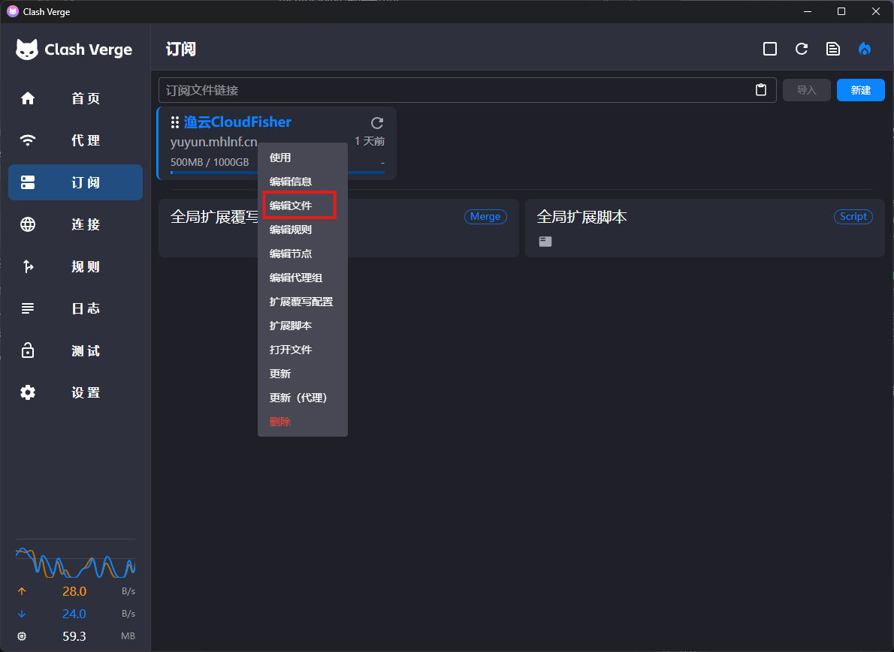
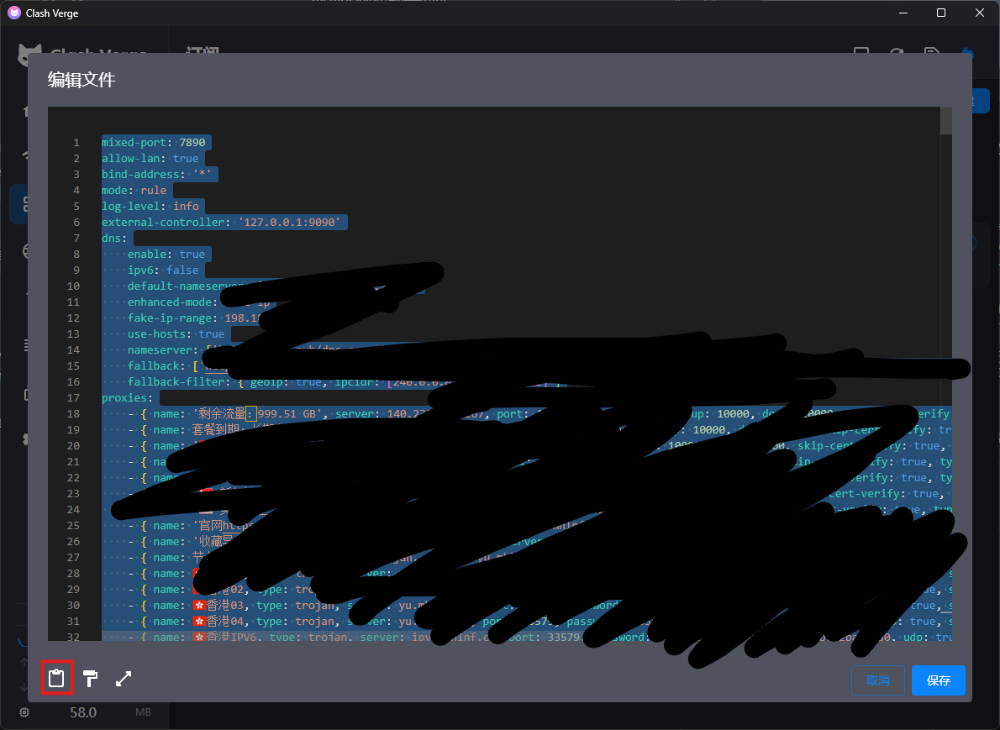

# Mihomo Linux 服务器代理配置指南

## 目录

- [简介](#简介)
- [安装部署](#安装部署)
- [配置文件说明](#配置文件说明)
- [Web UI 配置](#web-ui-配置)
- [常用命令](#常用命令)
- [系统服务配置](#系统服务配置)

## 简介

Mihomo（原名 Clash.Meta）是一个功能强大的代理工具，支持多种代理协议，适用于 Linux 服务器环境。

### 主要特性

- 支持多种代理协议：SS、VMess、VLESS、Trojan、Hysteria、TUIC 等
- 内置 Web UI 管理界面
- 支持 TUN 模式透明代理
- 规则分流、DNS 分流
- 支持代理订阅

## 安装部署

### 1. 下载文件

本项目已包含以下文件：

```
mihomo-linux/
├── mihomo-linux-amd64     # 主程序 v1.19.20 (34MB)
├── config.yaml            # 配置文件示例
├── ui/                    # MetaCubeXD Web UI v1.241.2
└── data/
    ├── geoip.dat          # GeoIP 数据库 (20MB)
    ├── geosite.dat        # GeoSite 数据库 (3.9MB)
    └── country.mmdb       # MaxMind MMDB (8.5MB)
README.md                  # 完整配置文档
WEB_UI.md                  # Web UI 配置指南
```

### 2. 安装到系统

```bash
# 复制主程序到系统路径
sudo cp mihomo-linux-amd64 /usr/local/bin/mihomo
sudo chmod +x /usr/local/bin/mihomo

# 创建配置目录
sudo mkdir -p /etc/mihomo

# 复制配置文件、数据库 和 UI
sudo cp config.yaml /etc/mihomo/
sudo cp -r ui /etc/mihomo/
sudo cp geoip.dat /etc/mihomo/
sudo cp geosite.dat /etc/mihomo/
sudo cp country.mmdb /etc/mihomo/
```

### 3. 验证安装

```bash
mihomo -v
```

## 配置文件说明

建议直接使用ClashVerge内下载好的配置文件。





若想使用Web UI需按[控制器配置（Web UI）](###控制器配置（Web UI）)配置配置文件。访问时使用**IP:9090/ui**的格式访问。

```yaml
# 外部控制器地址
external-controller: 0.0.0.0:9090

# Web UI 目录（相对路径）
external-ui: ui

# 访问密钥（建议设置）
secret: "your-secret-key"
```


### 基础配置

```yaml
# 混合端口（HTTP+SOCKS5）
mixed-port: 7890

# 允许局域网连接
allow-lan: true

# 绑定地址
bind-address: "*"

# 运行模式：rule/global/direct
mode: rule

# 日志级别：silent/error/warning/info/debug
log-level: info
```

### 控制器配置（Web UI）

```yaml
# 外部控制器地址
external-controller: 0.0.0.0:9090

# Web UI 目录（相对路径）
external-ui: ui

# 访问密钥（建议设置）
secret: "your-secret-key"
```

### DNS 配置

```yaml
dns:
  enable: true
  ipv6: false
  
  # DNS 模式：normal/fake-ip
  enhanced-mode: fake-ip
  fake-ip-range: 198.18.0.1/16
  
  # 上游 DNS
  default-nameserver:
    - 223.5.5.5
    - 119.29.29.29
  
  # 主 DNS 服务器
  nameserver:
    - https://doh.pub/dns-query
    - https://dns.alidns.com/dns-query
  
  # 回退 DNS（用于解析国外域名）
  fallback:
    - https://1.1.1.1/dns-query
    - https://dns.google/dns-query
```

### 代理节点配置

#### Shadowsocks

```yaml
proxies:
  - name: "ss-node"
    type: ss
    server: server.com
    port: 443
    cipher: aes-256-gcm
    password: "password"
```

#### VMess

```yaml
proxies:
  - name: "vmess-node"
    type: vmess
    server: server.com
    port: 443
    uuid: uuid
    alterId: 0
    cipher: auto
    tls: true
    skip-cert-verify: false
    servername: example.com
    network: ws
    ws-opts:
      path: /path
      headers:
        Host: example.com
```

#### VLESS

```yaml
proxies:
  - name: "vless-node"
    type: vless
    server: server.com
    port: 443
    uuid: uuid
    flow: xtls-rprx-vision
    tls: true
    servername: example.com
```

#### Trojan

```yaml
proxies:
  - name: "trojan-node"
    type: trojan
    server: server.com
    port: 443
    password: password
    sni: example.com
    skip-cert-verify: false
```

#### Hysteria2

```yaml
proxies:
  - name: "hy2-node"
    type: hysteria2
    server: server.com
    port: 443
    password: password
    sni: example.com
    skip-cert-verify: false
```

### 代理组配置

```yaml
proxy-groups:
  - name: "Proxy"
    type: select
    proxies:
      - node-1
      - node-2
      - DIRECT
      
  - name: "Auto"
    type: url-test
    proxies:
      - node-1
      - node-2
    url: "http://www.gstatic.com/generate_204"
    interval: 300
```

### 规则配置

```yaml
rules:
  # 直连
  - DOMAIN-SUFFIX,google.com,Proxy
  - DOMAIN-KEYWORD,google,Proxy
  
  # 拒绝
  - DOMAIN-SUFFIX,ad.com,REJECT
  
  # 国内直连
  - GEOIP,CN,DIRECT
  
  # 局域网直连
  - GEOIP,LAN,DIRECT
  
  # 兜底规则
  - MATCH,Proxy
```

## Web UI 配置

### 访问 Web UI

启动 mihomo 后，通过浏览器访问：

```
http://服务器IP:9090/ui
```

### 配置说明

在 `config.yaml` 中配置：

```yaml
# 外部控制器
external-controller: 0.0.0.0:9090

# UI 文件目录
external-ui: ui

# 访问密钥
secret: "your-secret"
```

### 使用在线 UI

也可以使用在线 UI，无需下载：

```yaml
external-ui-url: "https://github.com/MetaCubeX/metacubexd/archive/refs/heads/gh-pages.zip"
```

或直接访问在线版本：

- MetaCubeXD: https://metacubexd.pages.dev/
- Yacd: http://yacd.haishan.me/

连接地址填写：`http://服务器IP:9090`

### 安全建议

1. **设置密钥**：务必设置 `secret` 参数
2. **限制访问**：使用防火墙限制 9090 端口访问
3. **使用 HTTPS**：建议配合 Nginx 反向代理启用 HTTPS

## 常用命令

### 启动服务

```bash
# 前台运行
mihomo -d /etc/mihomo

# 指定配置文件
mihomo -f /path/to/config.yaml
```

### 测试配置

```bash
mihomo -t -f /etc/mihomo/config.yaml
```

### 查看版本

```bash
mihomo -v
```

## 系统服务配置

创建 systemd 服务文件：

```bash
sudo nano /etc/systemd/system/mihomo.service
```

内容：

```ini
[Unit]
Description=Mihomo Proxy Service
After=network.target

[Service]
Type=simple
User=root
ExecStart=/usr/local/bin/mihomo -d /etc/mihomo
Restart=on-failure
RestartSec=5s

[Install]
WantedBy=multi-user.target
```

管理服务：

```bash
# 重载配置
sudo systemctl daemon-reload

# 启动服务
sudo systemctl start mihomo

# 开机自启
sudo systemctl enable mihomo

# 查看状态
sudo systemctl status mihomo

# 查看日志
journalctl -u mihomo -f
```

## 代理订阅

支持从订阅链接导入节点：

```yaml
proxy-providers:
  my-subscription:
    type: http
    url: "订阅链接"
    interval: 3600
    path: ./proxy-providers/my-sub.yaml
    health-check:
      enable: true
      interval: 600
      url: http://www.gstatic.com/generate_204

proxy-groups:
  - name: "Subscription"
    type: select
    use:
      - my-subscription
```

## 常见问题

### 1. 无法访问 Web UI

检查防火墙是否开放 9090 端口：

```bash
sudo ufw allow 9090
# 或
sudo firewall-cmd --add-port=9090/tcp --permanent
sudo firewall-cmd --reload
```

### 2. 代理不生效

- 检查配置文件语法：`mihomo -t`
- 检查端口是否被占用：`netstat -tlnp | grep 7890`
- 查看日志排查问题

### 3. DNS 解析问题

- 检查 `enhanced-mode` 设置
- 确认 `fake-ip-filter` 配置正确
- 尝试切换 DNS 服务器

## 相关链接

- 官方 Wiki: https://wiki.metacubex.one/
- GitHub: https://github.com/MetaCubeX/mihomo
- Dashboard: https://github.com/MetaCubeX/metacubexd
