# iOS苹果-Shadowrocket使用教程

---

## 使用前必读！！！👇

⚠⚠ **重要提醒：**
通过任何途径获取的海外共享 **iOS ID 账号**，请仅在 **App Store** 中登录使用。禁止在 iOS 系统设置中登录此类账号！若因操作不当导致设备被锁，我们概不负责。登陆时禁止绑定自己的手机号。安装好所需软件后请退出共享账户。

## 使用前必读！！！👆

📖📖 **初次使用小火箭（Shadowrocket）用户：**
购买订阅后请认真阅读操作步骤，按照步骤操作，如出现步骤外不能解决问题请发工单或者联系 TG 群管理解决。

**1. 打开 App Store：** 共享账户一般只能用于下载，不能更新，需要更新的 APP 请卸载后重新下载即可。
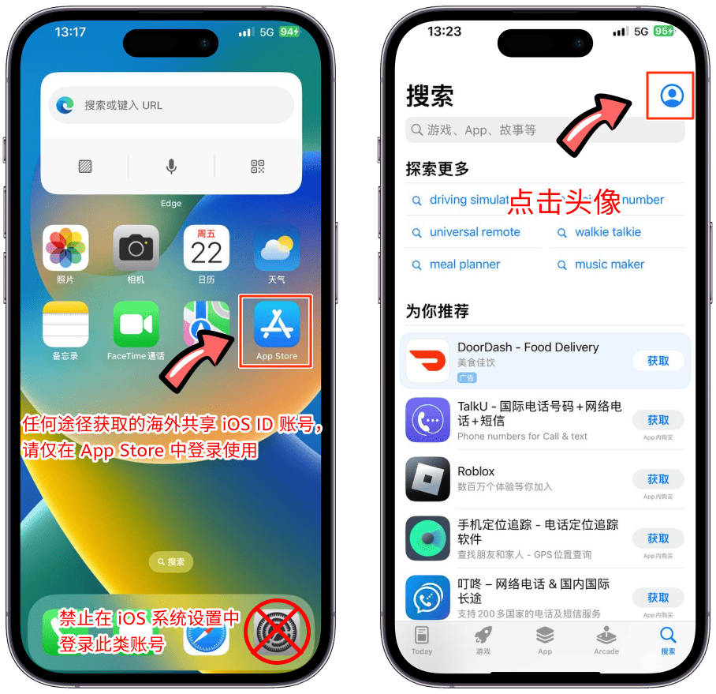

**2. 退出本机登录账户：** 退出后可以关闭 App Store 后再进入。
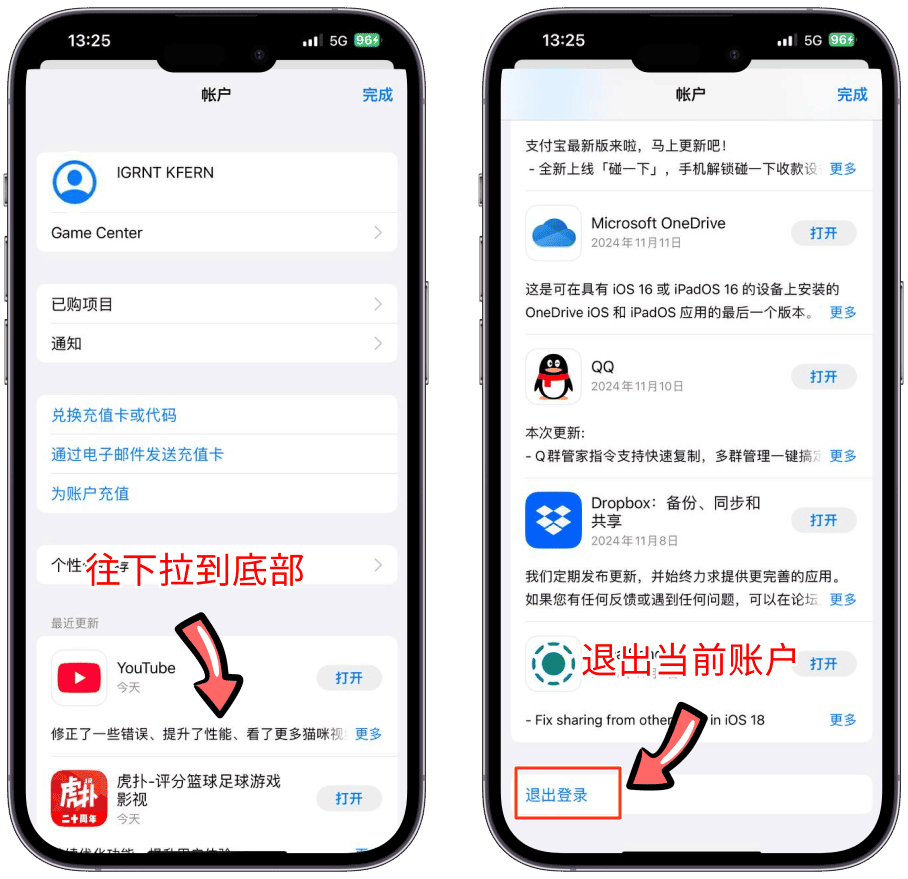

**3. 返回浏览器：** 官网 iOS 教程文档中复制账号和密码后打开 App Store 里登录复制的账号及密码。（账号提示异常请切换账号使用）
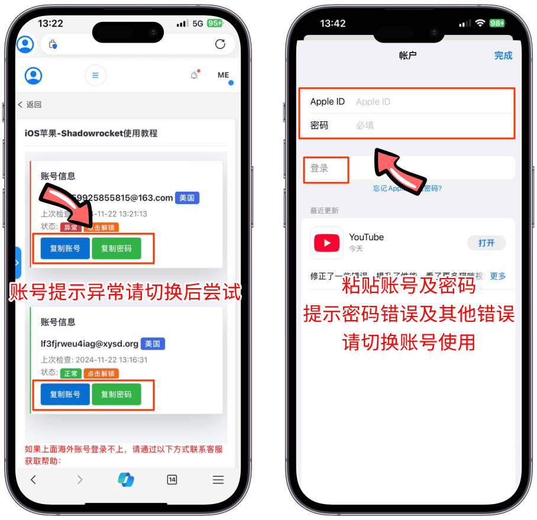

**4. 处理安全提示：** 登录后有可能会提示 Apple ID 安全问题，选择"不升级账户安全"或者跳过，提示绑定手机号请更换一个账户操作。
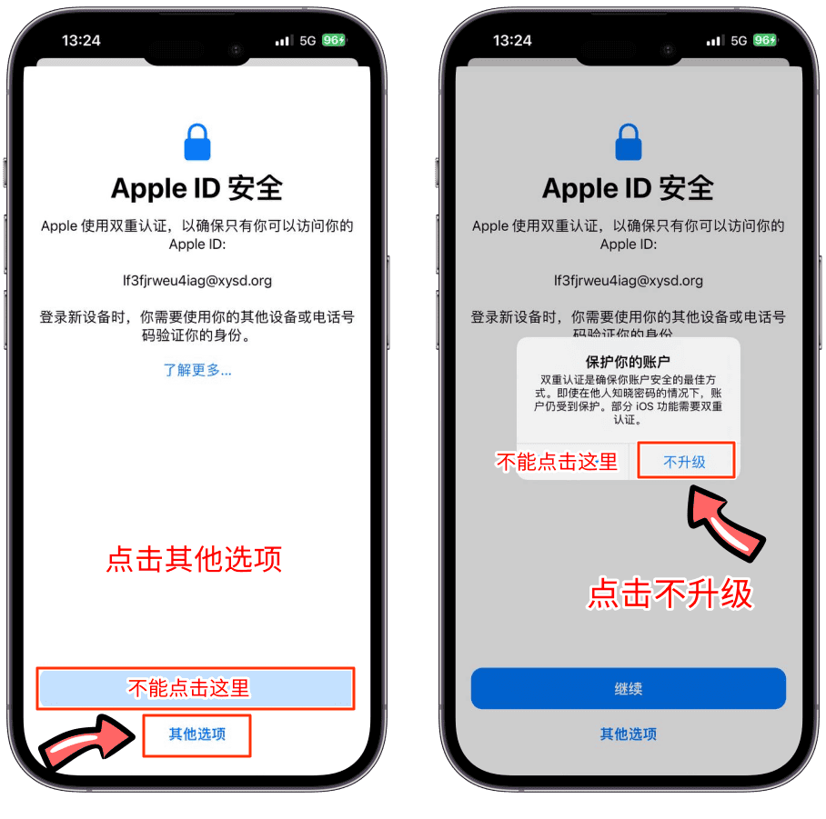

**5. 搜索并下载 Shadowrocket：** 在搜索框中输入"Shadowrocket"或者"小火箭"进行下载，请注意 APP 名称和销售商名称，一切带有中文的都是盗版软件，下载后打开软件确认界面。（成功登录后没有切换地区请先关闭 App Store 再打开）
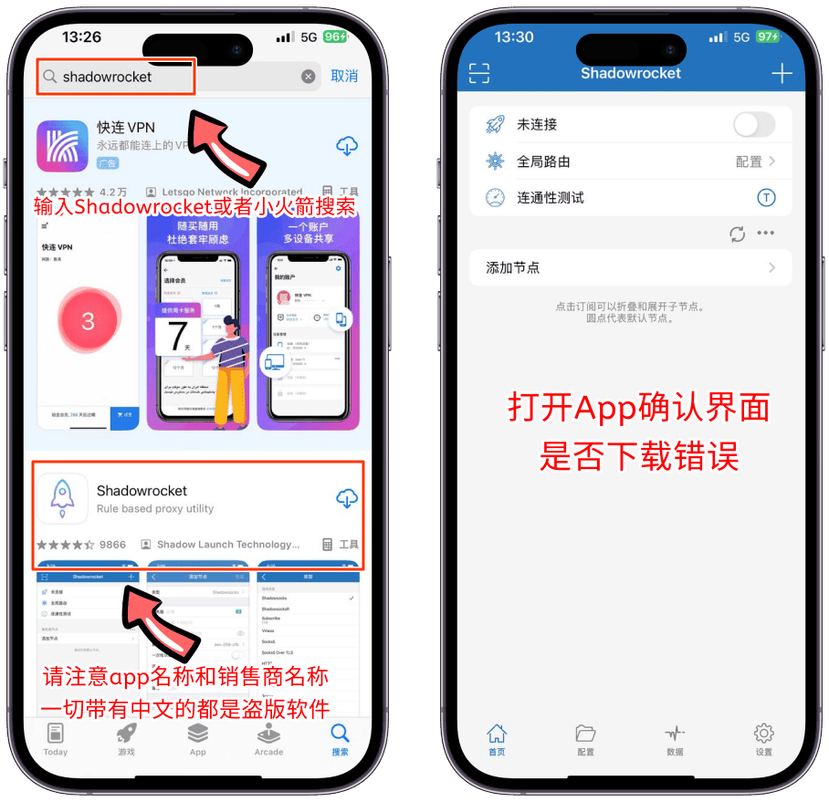

**6. 安装小火箭后导入订阅链接：** 返回浏览器，官网首页下拉找到 Shadowrocket 订阅按钮，允许跳转到外部应用。（无法跳转点击第一个按钮复制链接进行导入，或者保存二维码后扫码导入）
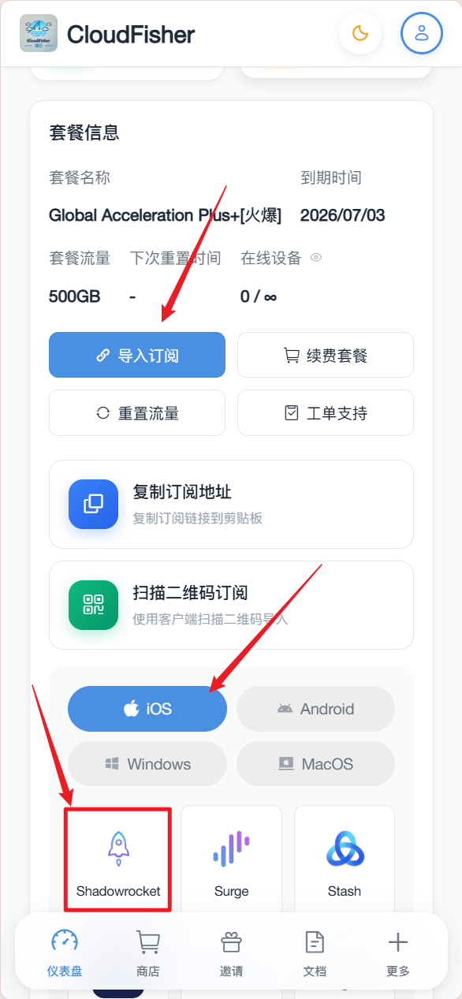
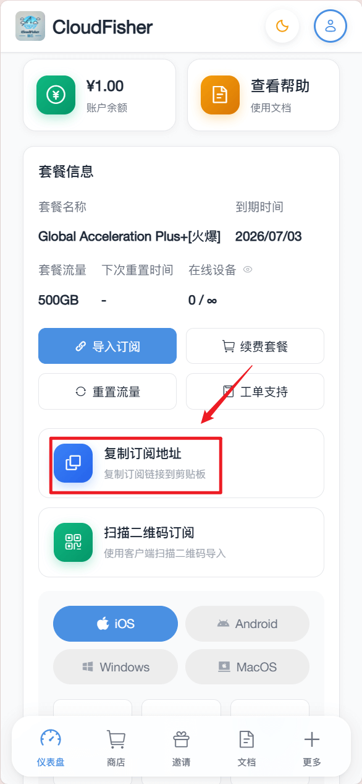

**6.1 使用其他工具导入：** 链接其他可用机场节点或者 VPN 软件后导入，代理软件可以全局和规则切换尝试。

**7. 启用 VPN 配置：** 导入成功后会出现机场节点列表，首次打开开关会提示安装 VPN 配置文件，请允许相关提示内容，否则无法使用。
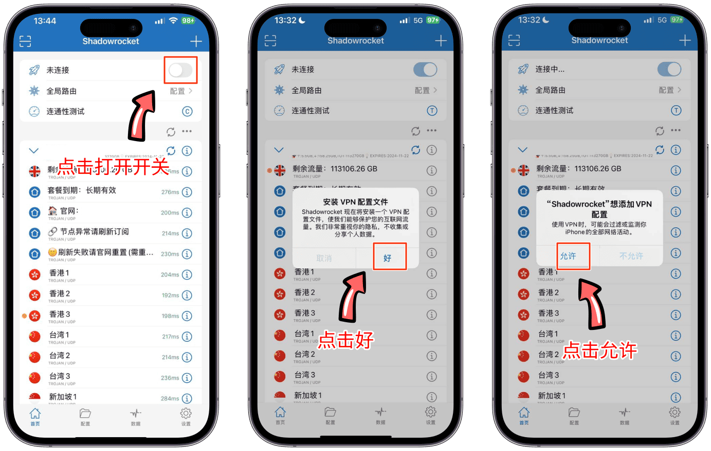

**8. 成功安装后：** 打开 VPN 开关即可实现上网功能。

## 补充步骤

**1. 当无法访问外网时：** 确认打开开关后，点击连通性测试后面的 T 图标，修改为 connect 模式后返回首页，再点连通性测试，查看节点延迟是否正常。若均超时，返回官网重新导入后再检测。
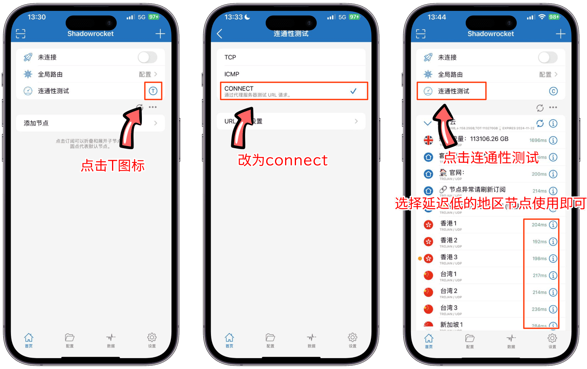

**1.1 检查网络环境：** 如果仍然超时，请检查是否为新疆、海外、校园网，或设备是否开了其他的代理或加速器。

**2. 新疆或 IPv6 用户：** 使用 WiFi 或网线时，确保本地支持 IPv6，并启用光猫、路由器及软件中的 IPv6 开关。手机流量默认开通了 IPv6，只需打开软件中的 IPv6 开关即可。
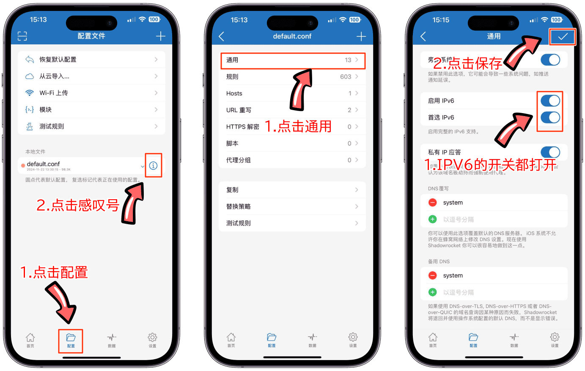

**3. 全局路由模式：**
- **配置（规则）：** 按规则决定哪些流量走代理，哪些直连。
- **代理（全局）：** 所有流量通过代理进行访问（可修改国内 APP 地址）。
- **直连：** 所有流量通过本地网络，不通过代理。
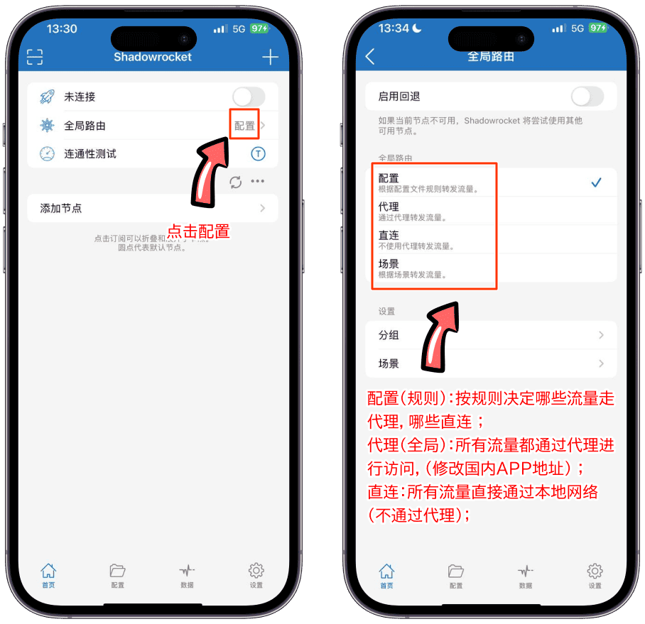
