# Android安卓—Clash Meta for Android教程（安卓推荐）

软件安装和节点导入问题不懂请发起工单解决:
### 1.下载安卓Clash Meta for Android—— [点击下载](https://dow.hongxing.one/app/cmfa-2.11.2-meta-arm64-v8a-release.apk) ：
---
## 一、初次购买用户购买订阅后请认真阅读图片步骤，按照步骤操作，如出现步骤外不能解决问题请联系客服。本教程浏览器是用谷歌浏览器进行录制，受限于浏览器或者手机品牌可能有些内容略微有差异，可以根据步骤内容意思来操作。
## Clash Meta for Android代理配置安装步骤
1.点（点击下载）下载 Clash Meta for Android 代理软件
---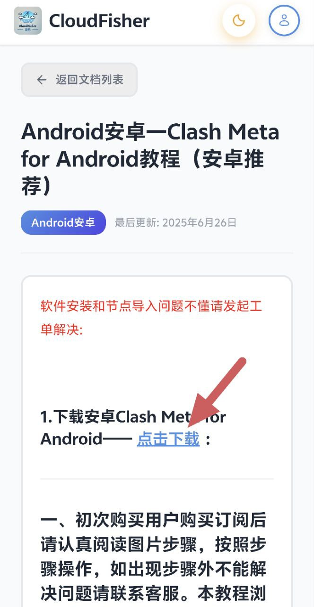
2.下载后安装Clash Meta for Android 代理软件，如果手机设置里打开了禁止安装未知来源应用，请根据提示步骤允许设备安装未知应用
---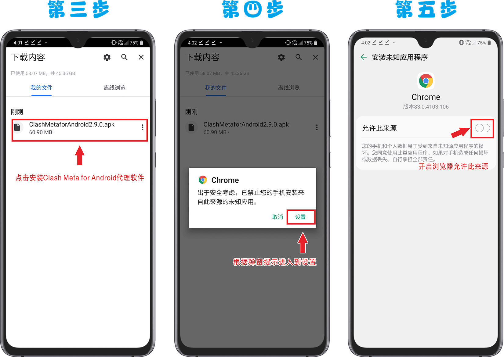
3.打开设备允许设备安装未知应用功能后返回下载页面，点击Clash Meta for Android下载安装包安装
---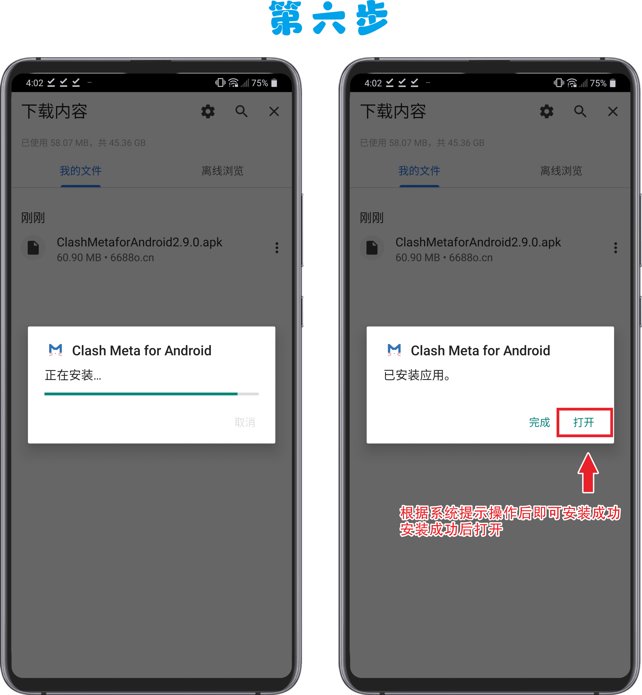
## 4.确定手机设备可以打开软件后返回浏览器CloudFisher官网首页，首页下拉找到快捷导入订阅功能区，点击clash订阅按钮（没有自动跳转请下拉阅读补充步骤）
---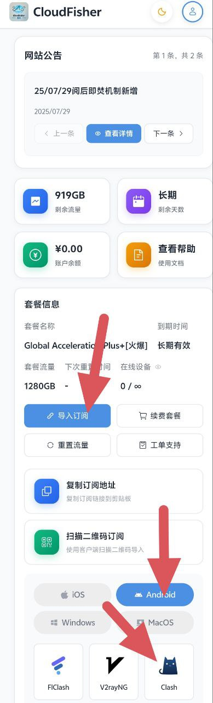
5.在官网中点击clash订阅后会自动跳转到Clash Meta for AndroidAPP配置中，按照自己需求修改自动更新时间（1440分钟为1天时间），确保和服务器处于同步更新状态，修改后点击右上角保存按钮，耐心等待下载配置文件
---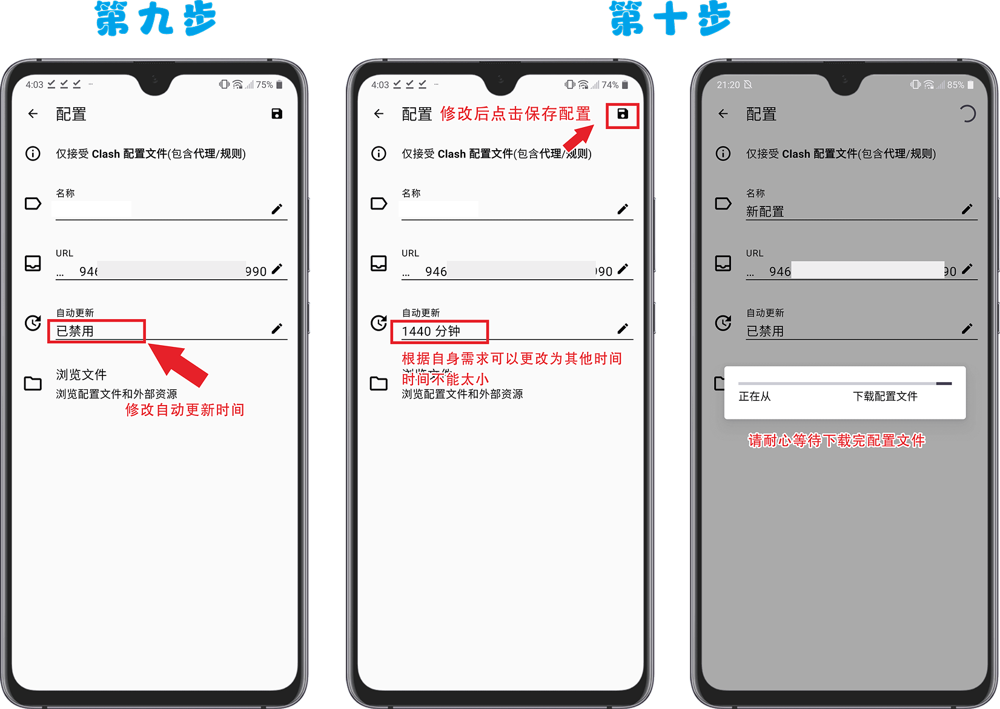
6.成功保存配置后返回到app首页，点击配置功能进入配置功能页，点击配置前圆圈按钮，显示下图圆圈状态后返回app首页。
---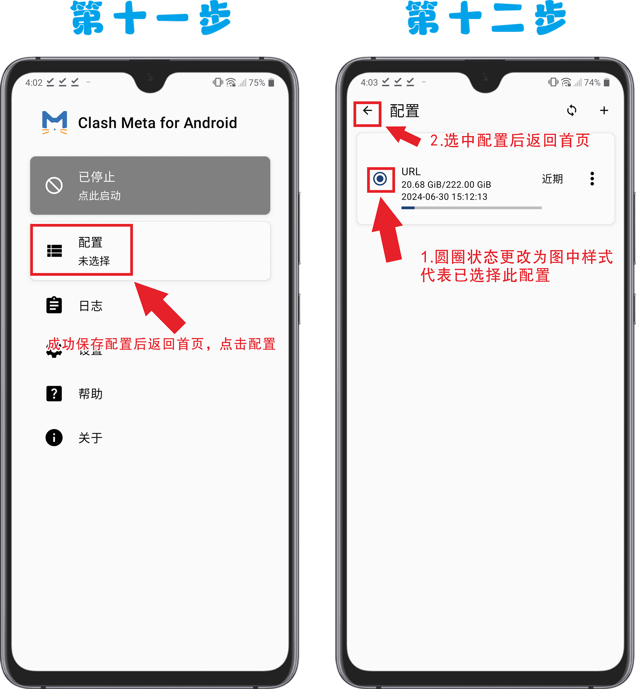
7.选中配置返回首页配置下方会出现 CloudFisher已激活 字段，首次打开会弹窗连接请求提示，点击确认后就可以实现魔法上网。成功运行后屏幕顶部会显示Clash Meta 标志，证明已正确开启 Clash Meta 软件服务。
---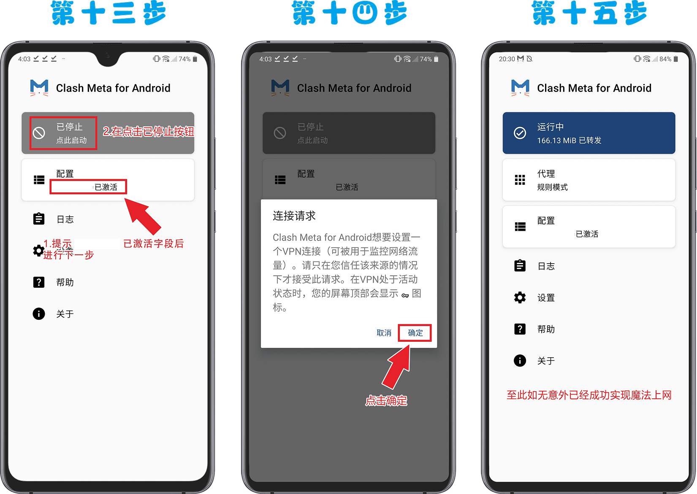
## 二、补充步骤
## 1.在官网首页快捷导入订阅功能区中点击clash订阅没有自动跳转?
## 不同设备或是不同浏览器因为功能原因点击clash订阅按钮后没有自动跳转到Clash Meta for Android代理软件中的情况下，请手动打开Clash Meta for Android软件，点击配置后会看见多出一个CloudFisher，点击配置前圆圈按钮选中即可
---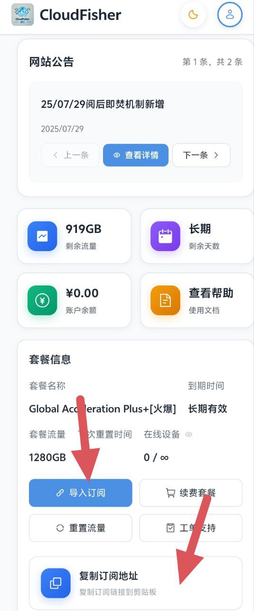
## 2.点进配置后依然没有CloudFisher订阅时可以通过复制订阅链接导入到Clash Meta for Android中
2.1打开浏览器CloudFisher官网首页，首页下拉找到快捷导入订阅功能区，点击复制链接按钮，复制成功后打开Clash Meta for Android软件点击配置
---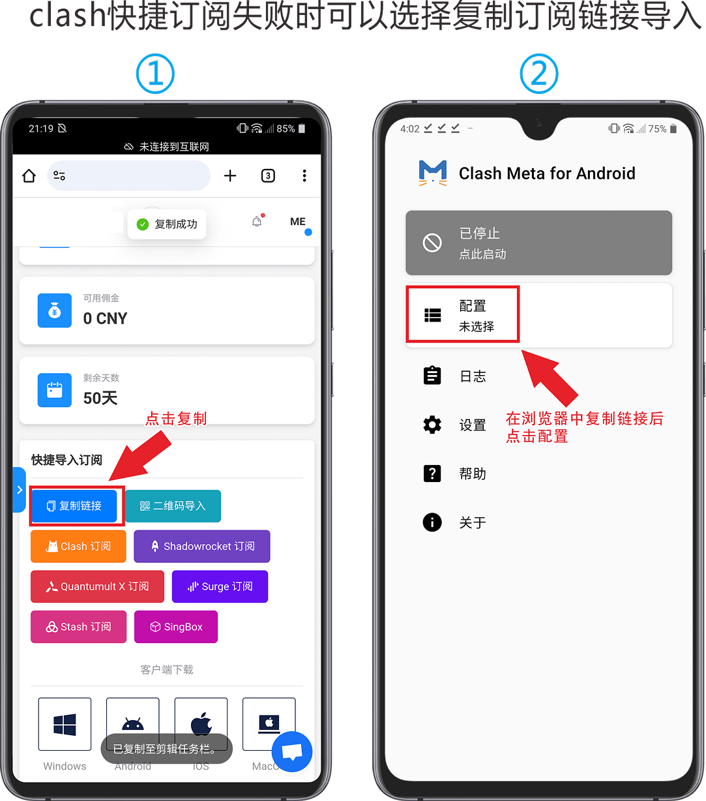
2.2进入配置页面后点击右上角 + 号，在点击URL（从URL导入）
---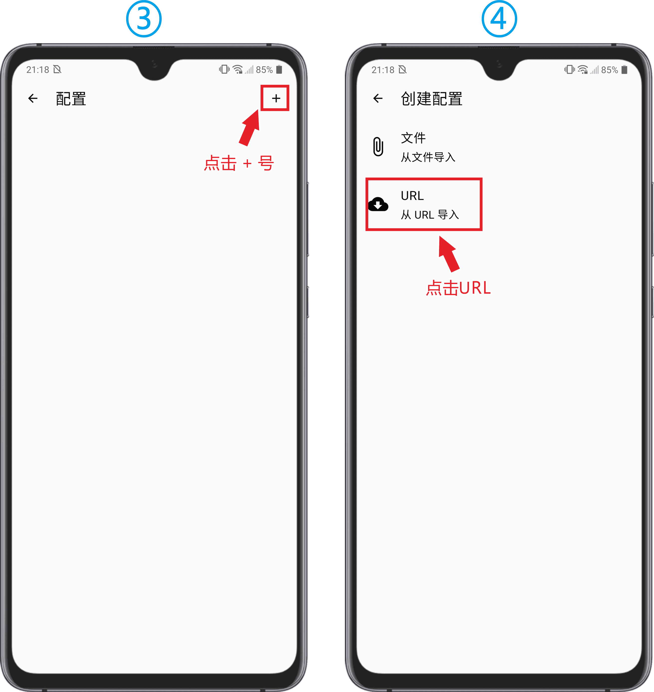
2.3点击URL输入框粘贴从浏览器CloudFisher官网首页快捷导入订阅功能区中的复制链接，粘贴后点击确认，耐心等待下载配置文件
---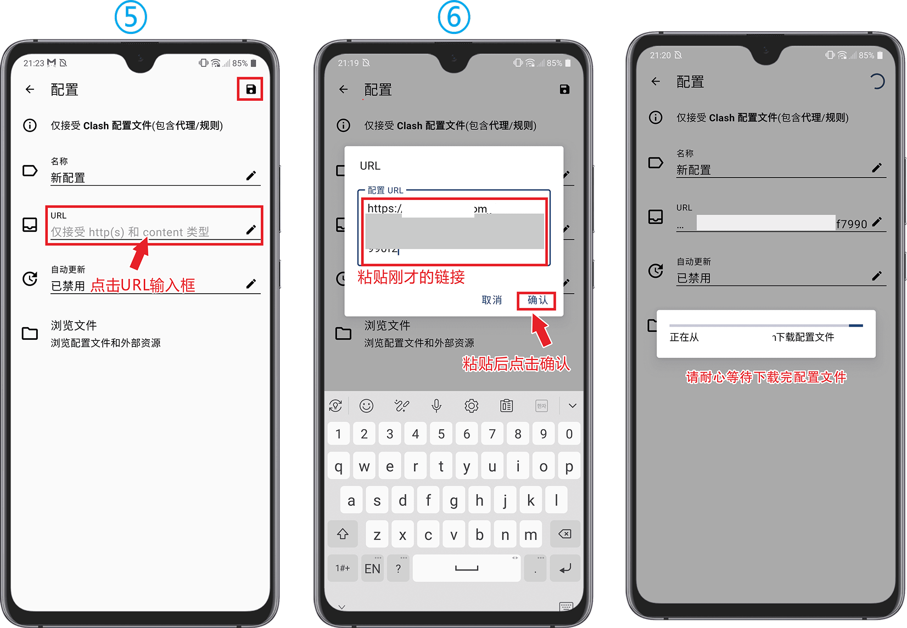
2.4下载完成后选中导入配置文件，返回首页确认是否选中，点击已停止按钮，初次使用会提示链接请求，点击确定后即可实现魔法上网。成功运行后屏幕顶部会显示Clash Meta 标志，证明已正确开启 Clash Meta 软件服务。
---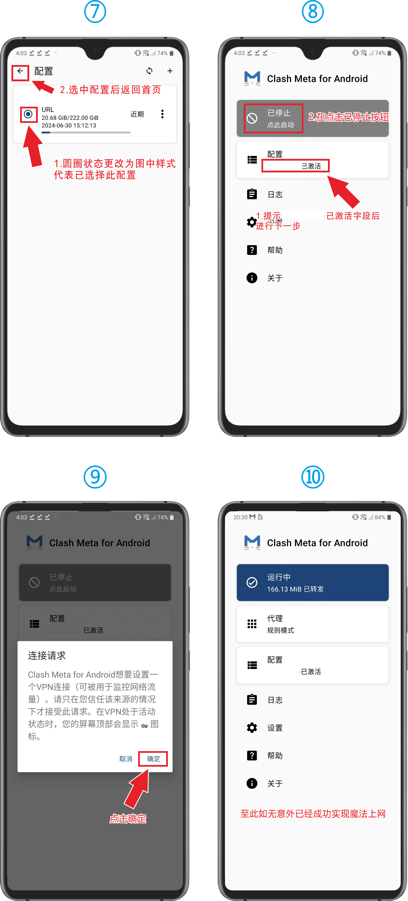
## 三、提示小贴士
当不能访问外网内容时候，进入Clash Meta首页点击配置，点击右上角刷新图标按钮，在返回首页中点击代理，点击闪电图标按钮查看节点延迟是否正常，显示数字即代表正常，出现超时字段请先确认自己套餐是否过期（过期后重新订阅导入即可使用），流量是否用完（流量用完重置后返回Clash Meta for Android刷新即可），如果还是不能解决问题请联系客服解决。
---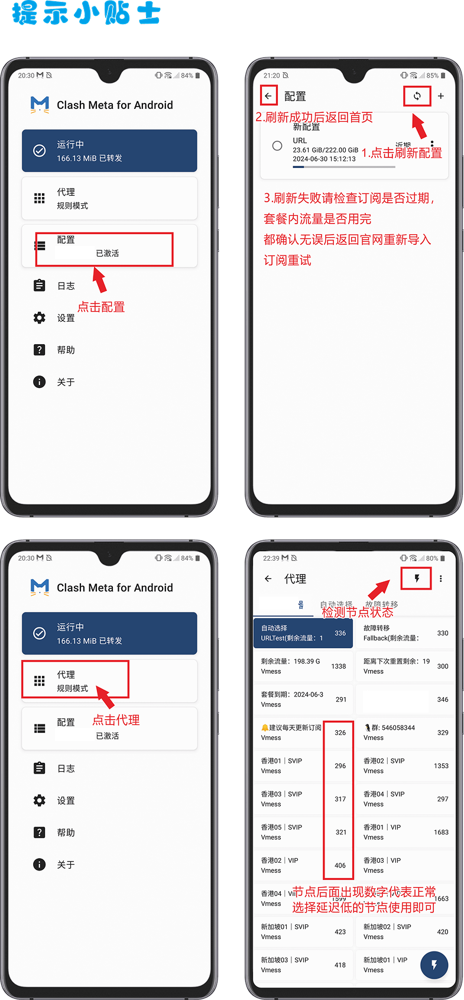