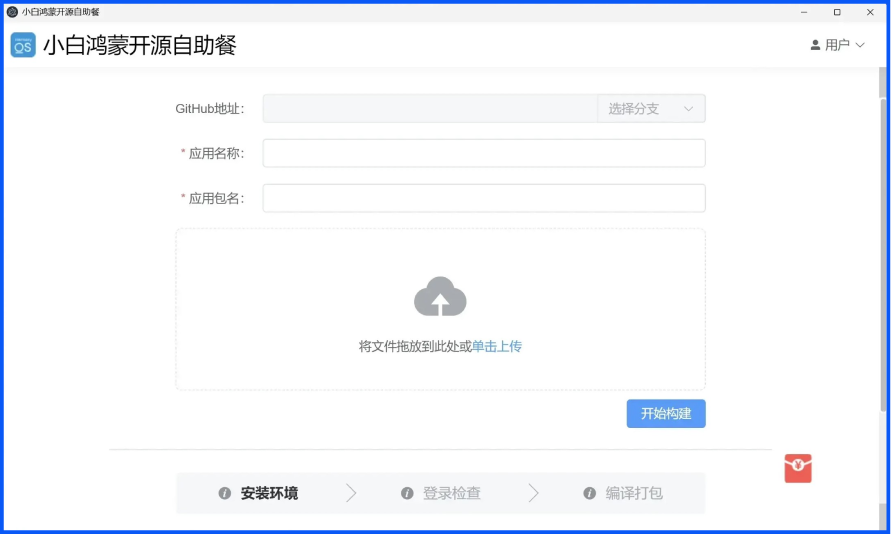
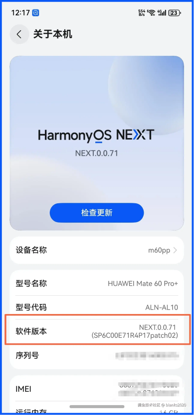
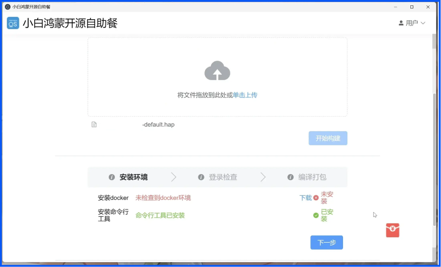
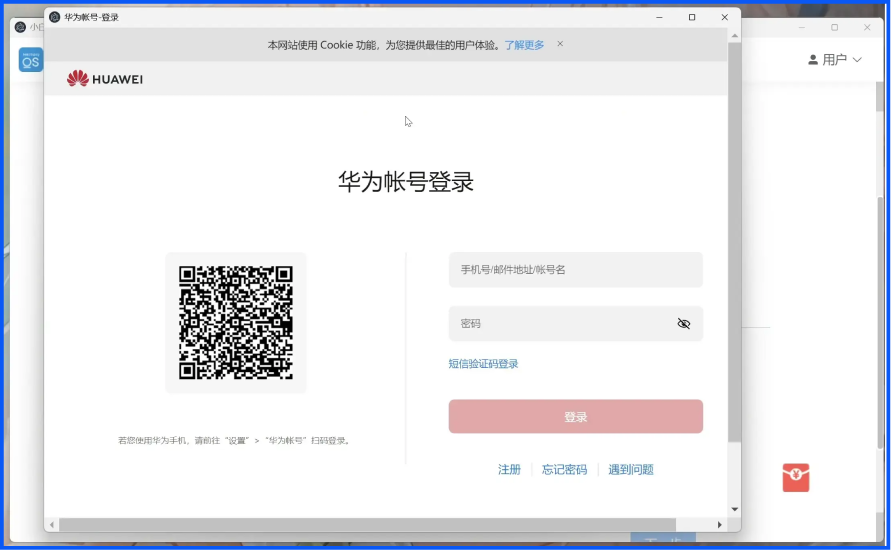
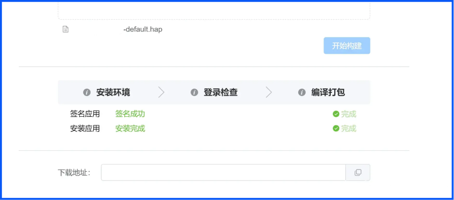

# 华为 — HarmonyOS Next教程

---

## 支持的系统版本

- 仅支持 **HarmonyOS Next** 以上系统版本
- 非 Next 系统可以尝试下载安卓软件并安装

## 项目地址

- **ClashBox** (鸿蒙代理工具)：https://github.com/xiaobaigroup/ClashBox
- **Auto-installer** (鸿蒙应用安装工具)：https://github.com/likuai2010/auto-installer

## 安装步骤

### 1. **下载软件包**

前往 ClashBox 的 [Releases](https://github.com/xiaobaigroup/ClashBox/releases) 页面下载最新版本的 `.hap` 文件。

前往 Auto-installer 的 [Releases](https://github.com/likuai2010/auto-installer/releases) 页面下载最新版本的安装程序。

将下载的文件保存到 **Windows** 电脑上。

安装前建议关闭 **电脑的杀毒软件**，以防止部分杀毒软件误报。

### 2. **安装 AutoInstaller**
双击安装 **AutoInstaller**。

安装完成后，打开 **AutoInstaller** 软件。

### 3. **拖入 ClashBox 安装包**
将 **ClashBox** 的 .hap 安装包直接拖入，或者点击 **上传** 按钮选择文件。

选择 **ClashBox** 的 `.hap` 文件后，进入下一步。

### 4. **设备开启开发者模式**
打开手机设置，找到 **关于手机**，多次点击 **"软件版本"** 来开启开发者模式，设备会重启。

### 5. **开启 USB 调试模式**
进入设置 → 系统 → 开发者选项，开启 **USB 调试**，并用数据线连接手机与电脑。

### 6. **开始构建和安装**
在 **AutoInstaller** 中点击 **"开始构建"** 按钮，然后点击 **"下一步"**，无需安装 Docker。

### 7. **登录华为账号**
弹出华为账号登录窗口，输入你的 **华为账号** 和密码进行登录。

### 8. **完成安装**
点击 **"下一步"**，直到看到安装成功的提示。

### 9. **确认安装成功**
安装完成后，点击打开 **ClashBox** 软件，确认是否能够正常使用。

如果安装失败，请重新检查操作步骤。

### 10. **导入订阅**
返回官网首页快捷订阅区点击 **复制链接** 按钮，打开 ClashBox 后粘贴链接导入订阅。

此步骤可以阅读安卓 Clash Meta 教程。
